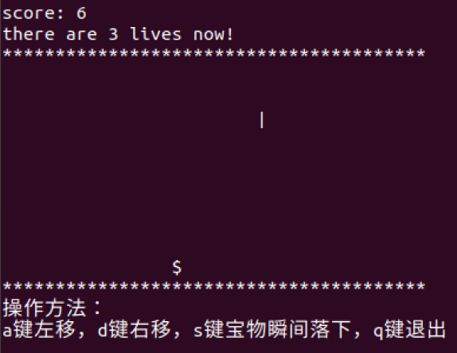

# 9 Lives Game

This is the first homework of course PGsql. I try to use signal() to catch some actions from user in the game.

## How to run?

open the shell, follow the steps 

1. make
2. ./game

## How to play?

a KEY means left，d KEY means right，s KEY means the props fall directly，q KEY means quit.

## Support Platform

only support Unix OS with gcc/g++

## Versioning

0.0.1

## Author

- 薛钦亮（Qinliang Xue) - xueql@ruc.edu.cn
